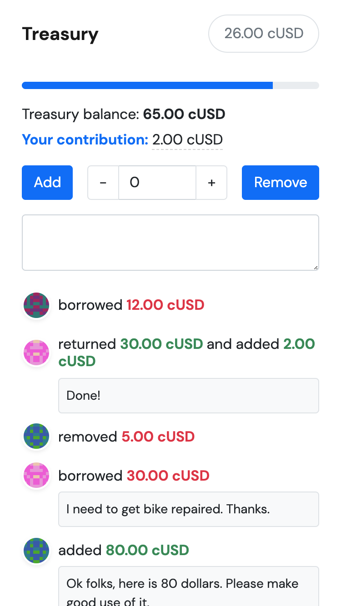

# Treasury


## Description
This is a simple treasury dapp where users can:
* See treasury balance and past transactions
* Add funds using the Celo Blockchain
* Borrow cUSD and return it later

## Live Demo
[Treasury Dapp](https://yip-theodore.github.io/treasury)

## Usage

### Requirements
1. Install the [CeloExtensionWallet](https://chrome.google.com/webstore/detail/celoextensionwallet/kkilomkmpmkbdnfelcpgckmpcaemjcdh?hl=en) from the Google Chrome Store.
2. Create a wallet.
3. Go to [https://celo.org/developers/faucet](https://celo.org/developers/faucet) and get tokens for the alfajores testnet.
4. Switch to the alfajores testnet in the CeloExtensionWallet.

### Test
1. Enter any amount and add funds.
2. Create a second account in your extension wallet and borrow some cUSD.
3. Still on your second account return the funds.
4. On the first account take back your cUSD.

## Project Setup

### Install
```
npm install
```

### Start
```
npm run dev
```

### Build
```
npm run build